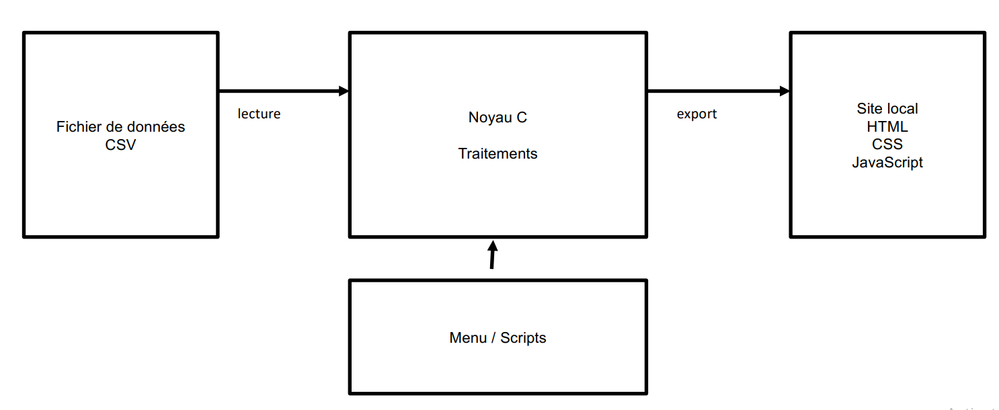
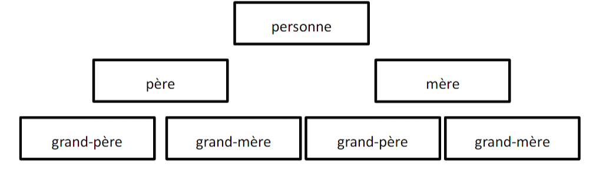

# S2 UE Informatique - Projet CIR1

### Présentation du projet

Le projet porte sur l'implémentation d'un outil capable de générer des fichier HTML à partir de certains informations formatés dans un fichier CSV.

**Contenu du fichier csv**
```
0,0,0,-,-,-,-
1,2,3,Hatton,Andrew,9/2/1801,Yorkshire 
2,0,0,Hatton,Steve,25/7/1775,Yorkshire 
3,0,0,Vockins,Mary,11/10/1777,West Yorkshire
```

 ### Architecture du projet


- Le noyau : Un programme C qui génère automatiquement un site 
- Les scripts : Un ensemble de scripts LINUX permettant d’utiliser simplement le noyau C 
- La sortie : Un ensemble de fichiers permettant d’afficher les résultats sous forme de site

**Architecture de sortie**


### Organisation du projet
```
📦projet_genealogie
 ┃┗ 📂 export                    // Dossier contenant la sortie
 ┃┃  ┗ 📜 *.html 
 ┃┣ 📂 ressources              // Dossier contenant les .csv
 ┃┣ 📂 scripts                 // Dossier script shell
 ┃┣ 📂 others 
 ┃┃  ┗ 📜 .css
 ┃┗ 📂 src                     // Noyau du projet
 ┃┃  ┣ 📜 person.h
 ┃┃  ┣ 📜 person.c
 ┃┃  ┣ 📜 population.h
 ┃┃  ┣ 📜 population.c
 ┃┃  ┣ 📜 filemanager.h
 ┃┃  ┣ 📜 filemanager.c
 ┃┃  ┣ 📜 advanced.h
 ┃┃  ┣ 📜 advanced.c
 ┃┃  ┣ 📜 htmlexport.h
 ┃┃  ┣ 📜 htmlexport.c
 ┃┃  ┗ 📜 makefile
  ┗ 📂 output
```


## Compilation et exécution du programme
0. Avoir le navigateur firefox d'installer sur votre os
1. Se rendre dans le dossier scripts
2. Modifier la permission sur le **script**  `chmod +x script.sh`
3. Compiler et exécuter le programme en utilisant la commande `./script.sh`.

**Note**
Après l'option choisie, la page s'ouvre automatique.
Si la nivagateur n'est pas intallé, il faudra ouvrir manuellement la page générée dans 📂export.

## Modification de la population

1. Ajout d'un fichier **csv** d'une population dans`/ressources`.
2. Se rendre dans le fichier **main.c** `/src/main.c`.
3. Modifier la ligne 89 `char* filename = "../ressources/NOM_DU_FICHIER";`.

## Membre de l'équipe:

- GANGUE Boris
- CORVAISIER Antoine
- CORNIC Maël
