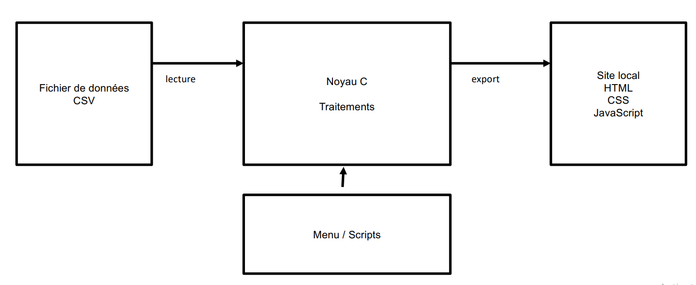
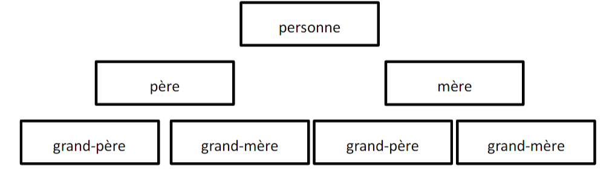

## ETUDE PRELEMINAIRE

### Présentation du projet
1. Objectifs
Le projet porte sur l'implémentation d'un outil capable de générer des fichier HTML à partir de certains informations formatés dans un fichier CSV.

**Contenu du fichier csv**
```
0,0,0,-,-,-,-
1,2,3,Hatton,Andrew,9/2/1801,Yorkshire 
2,0,0,Hatton,Steve,25/7/1775,Yorkshire 
3,0,0,Vockins,Mary,11/10/1777,West Yorkshire
```
2. Contraintes et exigences
- L'outil de génération doit être codé en langage C .
- L'ensemble des fichiers généré dois être statique.
- Obligation d'implémenter les fonctions fratrie et ancestors.
- Un fichier par personne; nom des fichiers html: [id_person]-fiche.html

3. Architecture du projet


- Le noyau : Un programme C qui génère automatiquement un site 
- Les scripts : Un ensemble de scripts LINUX permettant d’utiliser simplement le noyau C 
- La sortie : Un ensemble de fichiers permettant d’afficher les résultats sous forme de site

**Architecture de sortie**


### Organisation du projet
```
projet_genealogie
├─ export      (dossier contenant la sortie)
|  └─ .html
├─ ressources  (dossier contenant les .csv)
├─ scripts     (dossier script linux)
├─ others
|  └─ .css
└─   src       (noyau du projet)
    │  ├─ person.h
    │  ├─ person.c
    │  ├─ population.h
    │  ├─ population.c
    │  ├─ filemanager.h
    │  ├─ filemanager.c
    │  ├─ advanced.h
    │  ├─ advanced.c
    │  ├─ htmlexport.h
    │  ├─ htmlexport.c
    │  ├─ README.md
    │  └─  makefile
    └─ output  
```

### Planification et organisation des tâches
|       Jours       |                            Tâches                                          |
| ----------------- | ---------------------------------------------------------------------------|
|                   | Rédaction de l'étude prélimaire                                            |
|    24/05/24       | Implémentation des fonctions dans person.c, population.c, filemanager.c    |
|                   |                                                                            | 
|                   | Récapitulation du travail éffectuer la veille                              |
|    25/05/24       | Implémentation des fonctions dans advanced.c (ancestors & fratrie)         |
|                   |                                                                            |
|                   | Récapitulation du travail éffectuer la veille                              |
|    26/05/24       | Implémentation des fonctions dans htmlexport + makefile                    |
|                   |                                                                            |
|                   | Récapitulation du travail éffectuer la veille                              |
|    27/05/24       | Implémentation du script                                                   |
|                   | Définition et implémentation d'autres fonctionnalités                      |
|                   |                                                                            |
|                   | Récapitulation du travail éffectuer la veille                              |
|    28/05/24       | Rédaction la présentation finale du projet                                 |
|                   |                                                                            |
|    29/05/24       |  Finalisation                                                              |
--------------------------------------------------------------------------------------------------


### Reponsables du projet
- François LEGRAS
- Sylvain LEFEBVRE
