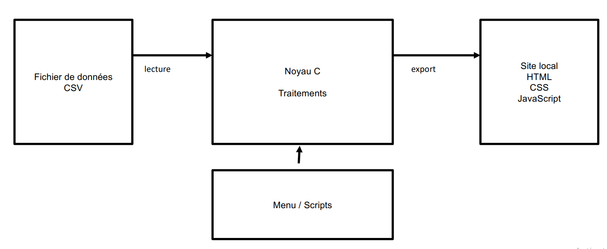

# Projet de fin d'année CIR2024 : Cahier des charges
# Groupes 4

<ins>Auteurs </ins>
- GANGUE Saan Boris
- CORVAISIER Antoine
- CORNIC Maël

## Objectif
Génération d'arbres généalogiques à partir de données existantes

## Architecture globale du système

## Architecture du système Site local

### Affichage des données contenant les informations généalogiques sur des personnes
-  Utiliser HTML, CSS et JS
-  Le noyau C génère les fichiers HTML : cette génération doit être automatique
- Le style des pages HTML, on utilise du CSS 
NB:  Site statique (généré 1 seule fois) et local

## Fonctionalités
- Lecture d'un fichier CSV avec le noyau C
- Possibilité d'effectuer des requêtes/traitements avec le menu ou via des scripts linux (au choix)
- Export de fichiers en HTML
- Visualisation en local du résultat via un 

## Description du projet

A faire plustard

## L'export HTML est géré par le noyau C

A faire plustard

## Création de menus/scripts linux

A faire plustard

Dépendances:
- strtok: librairie C qui permet de séparer une chaine de charatères à partir d'un charactère séparateur.
- atoi: converti ASCII to integer
- strncpy: permet de copier une chaîne de caractères en veillant à ne pas dépasser la taille du buffer.
- string.h

QUESTIONS:
- es ce que dans données on peut avoir des données manquantes au de la date d'anniversaire de style '_/10/2005' ou